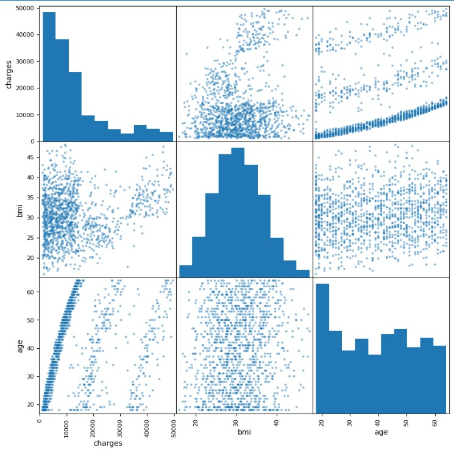
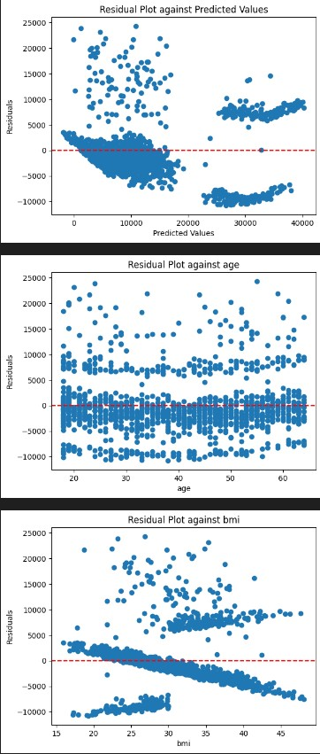
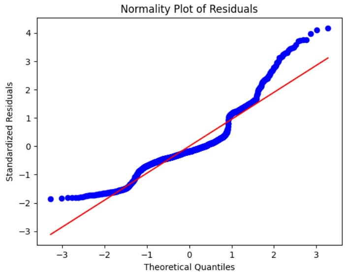
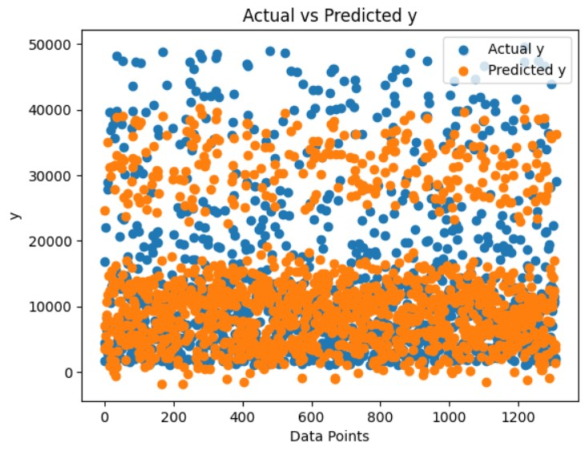
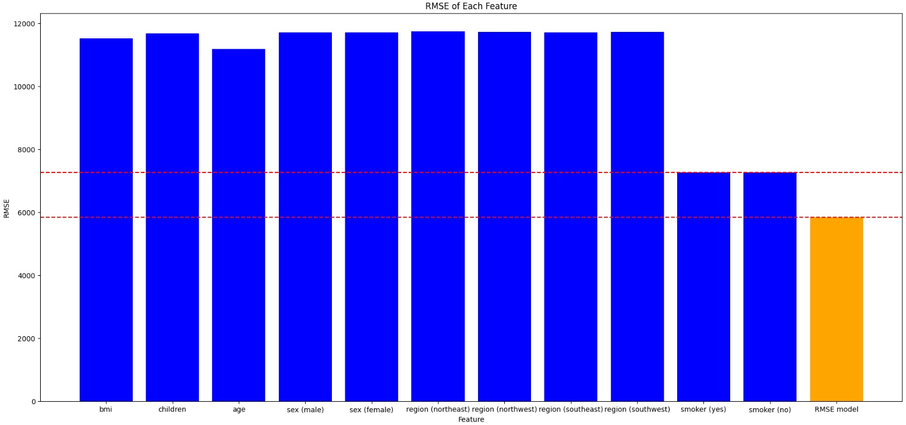

# Multiple Linear Regression Analysis on Medical Cost Dataset

## Overview
This project explores **medical insurance costs** by examining associations between multiple variables using **linear regression analysis**. We analyze data from the Medical Cost Personal Dataset, sourced from Kaggle, and develop models that identify significant predictors of medical charges based on demographic and lifestyle factors.

## Dataset
The dataset comprises **1338 rows** and **7 columns**:
- Quantitative variables: `age`, `bmi`, `children`, `charges`
- Categorical variables: `sex`, `smoker`, `region`

## Objectives
1. Determine factors influencing medical insurance costs using linear regression.
2. Develop a model that can predict medical charges based on input variables.
3. Assess model accuracy and reliability through statistical testing and error analysis.

## Methodology

### Data Preprocessing
1. **Outlier Removal**: Using the Z-score method, we identified and removed outliers for accurate regression modeling.
2. **Standardization**: Standardized numerical columns to maintain uniform scale across features.
3. **Encoding Categorical Variables**: Applied one-hot encoding to `sex`, `smoker`, and `region`.

### Statistical Tests
- **Normality Testing**: Shapiro-Wilk test for Gaussian distribution.
- **Exponential Testing**: Anderson-Darling test for exponential distribution.
- **Uniformity Testing**: Kolmogorov-Smirnov test for uniform distribution.

### Regression Analysis
1. **Simple Linear Regression**: Calculated regression coefficients manually and validated with Python’s `statsmodels` for each predictor.
2. **Multivariable Linear Regression**: Developed a multivariable model using Scikit-Learn’s `LinearRegression`, with `charges` as the response variable.
3. **Model Validation**:
   - **R-squared** and **Adjusted R-squared** for model goodness-of-fit.
   - **Root Mean Squared Error (RMSE)** for model accuracy.

### Visualization
- **Scatter Matrix**: Provided insights into potential associations between selected quantitative variables.

- **Residual Analysis**: Examined residual distribution to assess model reliability.

- **Breusch-Pagan Test**: Checked homoscedasticity for consistent variance of residuals.

- **QQ Plot**: Evaluated if residuals align with a normal distribution.

### Y Predicted vs Y Actual
- **Y Predicted vs Y Actual Plot**: This plot visualizes the relationship between the predicted medical charges and the actual charges.

### Key Findings
- **Smoker status** yields smaller error than other feautres when used as a feature for predicting charges.
- **Multivariable regression** outperforms simple regression for prediction, with **R² ≈ 0.75** and **RMSE ≈ 5828**.

## Conclusion
The model successfully captures the majority of the variability in medical costs based on predictors in the dataset. However, there are indications of heteroscedasticity and non-normal residuals, suggesting areas for potential model improvement or exploration of non-linear relationships.

## Acknowledgements
This analysis was submitted as part of the **SBE2240 Biostatistics course, Spring 2023** under the supervison of **[Dr. Ibrahim Youssef](https://scholar.google.com/citations?user=lzanfTsAAAAJ&hl=en)**.

## Contributors

|  |  |  |  |
|:---:|:---:|:---:|:---:|
| [Yasmin ElGamal](https://github.com/JasmineTJ) | [Salma Ashraf](https://github.com/Salma-me) | [Nouran Khatab](https://github.com/nouran-19) | [Basmalah Tarek](https://github.com/BasT13c) 